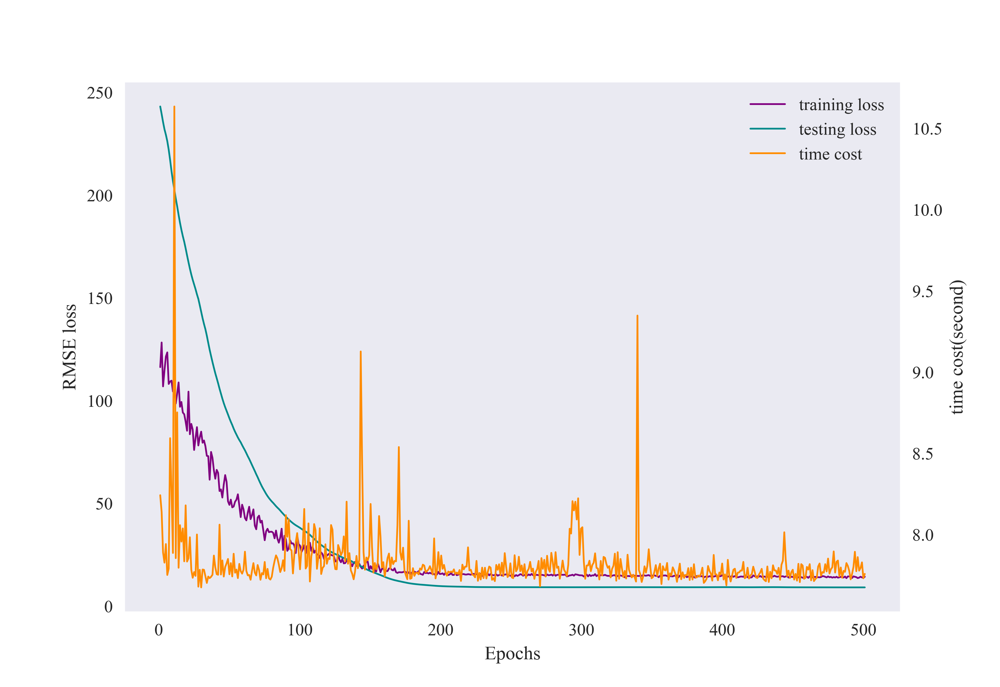

# Mini-Batch Adaptive Optimization Algorithm Based on Forward Automatic Differentiation for the Design of Efficient TSK Fuzzy Systems


## About

This is the origin Pytorch implementation of MBAO-FAD Algorithm in the following paper: **Mini-Batch Adaptive Optimization Algorithm Based on Forward Automatic Differentiation for the Design of Efficient TSK Fuzzy Systems**.  

We will continue this line of research and update on this repo. Please star this repo if you find our work is helpful for you. And, If you have any questions about this implementation or find any bugs or errors during use, please feel free to contact me. If you have any questions about the original article,  please contact the authors of related article.


## MBAO-FAD Algorithm
This paper greatly balance the **training efficient** and **computational cost**, including the **memory requirement** and **time cost**, for TSK fuzzy system, and propose a novel mini-batch adaptive optimization algorithm based on forward automatic differentiation (MBAO-FAD). The main innovations and contributions are summarized as:

- The forward automatic differentiation, alternatively termed as the forward gradient, strategy for the TSK fuzzy system is firstly given. And, the detailed mathematical derivation of the forward gradient is also given for the antecedents and consequents, in respectively.
- An efficient efficient matrix-free Jacobian-vector product algorithm is proposed for accelerating the gradient computational efficiency. Additionally, an improved nonnegative matrix factorization based mini-batch parameter update algorithm is proposed to further mitigate memory requirement and computational time cost.
- The proposed MBAO-FAD algorithm outperforms the comparisons on 10 real-world datasets from various application domains, in terms of the RMSE, the training time and the memory overhead.

<p align="center">

<br><br>
</p>


## Requirements

- Python 3.7
- matplotlib == 3.5.3
- numpy == 1.21.6
- pandas == 1.3.5
- scikit_learn == 1.0.2
- torch == 1.13.1

Dependencies can be installed using the following command:
```bash
pip install -r requirements.txt
```

## Dataset

The PM10 dataset used in the implementation can be downloaded in the repo. And, the datasets for other experiments in our paper are available at the following URLs:

<p align="center">

<br><br>
</p>


- [NO2](http://lib.stat.cmu.edu/datasets/NO2.dat)
- [Housing](https://archive.ics.uci.edu/ml/machine-learning-databases/housing/)
- [Concrete](https://archive.ics.uci.edu/ml/datasets/Concrete+Compressive+Strength)
- [Airfoil](https://archive.ics.uci.edu/ml/datasets/Airfoil+Self-Noise)
- [Wine-Red](https://archive.ics.uci.edu/ml/datasets/Wine+Quality)
- [Abalone](https://archive.ics.uci.edu/ml/datasets/Abalone)
- [Wine-White](https://archive.ics.uci.edu/ml/datasets/Wine+Quality)
- [PowerPlant](https://archive.ics.uci.edu/ml/datasets/Combined+Cycle+Power+Plant)
- [Protein](https://archive.ics.uci.edu/ml/datasets/Physicochemical+Properties+of+Protein+Tertiary+Structure)


## Result

**Figure 1** shows the performance of the proposed MBAO-FAD algorithm on the PM10 dataset. And, We are lucky that the proposed MBAO-FAD algorithm gets performance improvement on 10 real-world datasets.

<p align="center">

<br><br>
<b>Figure 1.</b> the performance of the proposed MBAO-FAD algorithm.
</p>


## Contact
If you have any questions, feel free to contact Hui Zhang through Email (202234949@mail.sdu.edu.cn) or Github issues. Pull requests are highly welcomed!

## Acknowledgments
I am very grateful to Professor [Dongrui Wu](https://github.com/drwuHUST) for his open source contribution([MBGD-RDA](https://github.com/drwuHUST/MBGD_RDA)), which played a vital role in promoting the progress of this research. At the same time, thank you all for your attention to this work!
