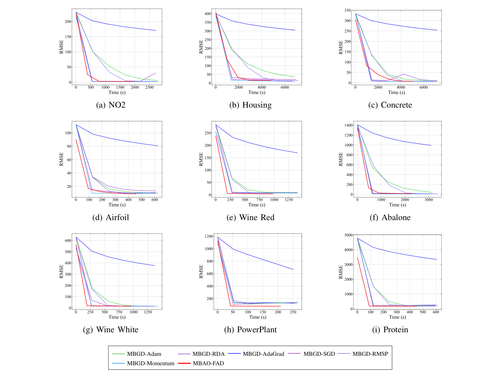
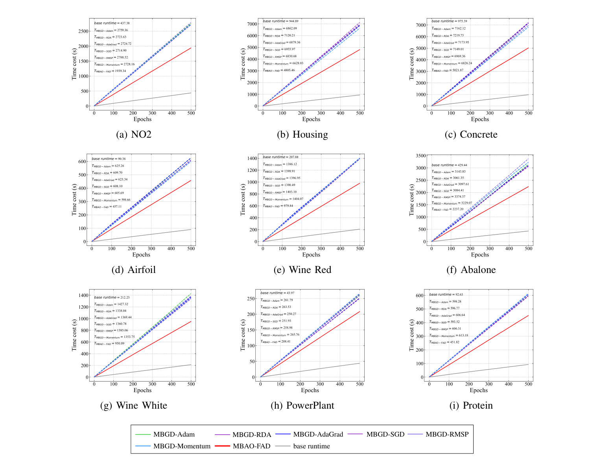

# Mini-Batch Adaptive Optimization Algorithm Based on Forward Automatic Differentiation for the Design of Efficient TSK Fuzzy Systems


## About

This is the origin Pytorch implementation of MBAO-FAD Algorithm in the following paper submitted for *IEEE/CAA Journal of Automatica Sinica*: **Mini-Batch Adaptive Optimization Algorithm Based on Forward Automatic Differentiation for the Design of Efficient TSK Fuzzy Systems**.  

Author: [Hui Zhang](https://ieeexplore.ieee.org/author/37089332415), Wei Peng, [Chengdong Li](https://ieeexplore.ieee.org/author/37577297400), ***Member, IEEE***, Guangyao Fan, [Bo Sun](https://ieeexplore.ieee.org/author/37086126603), ***Member, IEEE***, and [Qinglai Wei](https://ieeexplore.ieee.org/author/37409924100), ***Senior Member, IEEE***

We will continue this line of research and update on this repo. Please star this repo if you find our work is helpful for you. And, If you have any questions about this implementation or find any bugs or errors during use, please feel free to contact me. If you have any questions about the original article,  please contact the authors of related article.

## MBAO-FAD Algorithm
This paper greatly balance the **training efficient** and **computational cost**, including the **memory requirement** and **time cost**, for TSK fuzzy system, and propose a novel mini-batch adaptive optimization algorithm based on forward automatic differentiation (MBAO-FAD). The main innovations and contributions are summarized as: 

- A novel mini-batch adaptive optimization algorithm based on forward automatic differentiation (MBAO-FAD) was proposed to optimize TSK fuzzy systems. The proposed MBAO-FAD can construct a training pipeline for TSK fuzzy systems without backward propagation, which is fundamentally different from traditional algorithms and more computationally competitive.
- An efficient gradient estimation method based on matrix-free Jacobian-vector products was proposed. This method requires only a single forward automatic differentiation during the forward propagation of TSK fuzzy systems to achieve unbiased estimation of gradients for both antecedent and consequent parameters.
- A mini-batch fuzzy parameter update strategy based on non-negative matrix factorization was proposed. By using generalized Kullback--Leibler divergence, the gradient estimation matrix of fuzzy parameters is decomposed into the product of two rank-1 matrices, eliminating the need to store first-order and second-order moment estimates, thereby reducing the memory requirements for training TSK fuzzy systems.
- The proposed MBAO-FAD algorithm demonstrated superior performance compared to other algorithms in terms of optimization accuracy, training time, and memory overhead across nine real-world datasets from multiple application domains.

<p align="center">

<br><br>
</p>

<p align="center">

<br><br>
</p>


## Requirements

- Python 3.7
- matplotlib == 3.5.3
- numpy == 1.21.6
- pandas == 1.3.5
- scikit_learn == 1.0.2
- torch == 1.13.1

Dependencies can be installed using the following command:
```bash
pip install -r requirements.txt
```

## Dataset

The PM10 dataset used in the implementation can be downloaded in the repo. And, the datasets for other experiments in our paper are available at the following URLs:

<p align="center">

<br><br>
</p>


- [NO2](http://lib.stat.cmu.edu/datasets/NO2.dat)
- [Housing](https://archive.ics.uci.edu/ml/machine-learning-databases/housing/)
- [Concrete](https://archive.ics.uci.edu/ml/datasets/Concrete+Compressive+Strength)
- [Airfoil](https://archive.ics.uci.edu/ml/datasets/Airfoil+Self-Noise)
- [Wine-Red](https://archive.ics.uci.edu/ml/datasets/Wine+Quality)
- [Abalone](https://archive.ics.uci.edu/ml/datasets/Abalone)
- [Wine-White](https://archive.ics.uci.edu/ml/datasets/Wine+Quality)
- [PowerPlant](https://archive.ics.uci.edu/ml/datasets/Combined+Cycle+Power+Plant)
- [Protein](https://archive.ics.uci.edu/ml/datasets/Physicochemical+Properties+of+Protein+Tertiary+Structure)

## Comparative Algorithms

The detailed experimental configurations for the MBAO-FAD and its comparative algorithms are listed in Table 3. The adaptive MBGD algorithms, including MGBD-Adam, MGBD-RDA, and MGBD-AdaGrad are chosen as the comparison methods. To fully verify the effectiveness and advantages, some non-adaptive MBGD algorithms, such as MGDB-SGD, MGBD-RMSProp (abbreviate as MGBD-RMSP), and MGDB-Momentum are also selected as the comparatives. All the comparative algorithms are implemented using the PyTorch framework, and they undergo forward and backward propagation with the same number of iterations. All experiments are conducted on a laptop equipped with a 13-th generation Intel i9-13900KS processor, 16GB of RAM, and an NVIDIA RTX2090 GPU.

<p align="center">

<br><br>
</p>

## Result
We have demonstrated that the MBAO-FAD can achieve the machine learning tasks of TSK fuzzy system without the need for backward propagation. We cautiously and optimistically believe that MBAO--FAD, not only requires less computational time expense, but also possesses computational competitiveness, especially in comparison with the current state-of-the-art algorithm, MBGD-RDA. Comparative experiments across seven methods on the commonly nine datasets indicate that the proposed MBAO--FAD achieves overall optimal performance in terms of optimization accuracy (RMSE testing loss) and efficiency (computational time cost and computational memory overhead). This is an encouraging result. 

<p align="center">

<br><br>
<b>Figure 1.</b> the performance (training efficient) of the proposed MBAO-FAD algorithm.
</p>

<p align="center">

<br><br>
<b>Figure 2.</b> the performance (computational cost) of the proposed MBAO-FAD algorithm.
</p>

<p align="center">

<br><br>
</p>


## Contact
If you have any questions, feel free to contact Hui Zhang through Email (202234949@mail.sdu.edu.cn) or Github issues. Pull requests are highly welcomed!

## Acknowledgments
I am very grateful to Professor [Dongrui Wu](https://github.com/drwuHUST) for his open source contribution([MBGD-RDA](https://github.com/drwuHUST/MBGD_RDA)), which played a vital role in promoting the progress of this research. At the same time, thank you all for your attention to this work!
